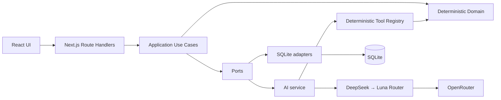
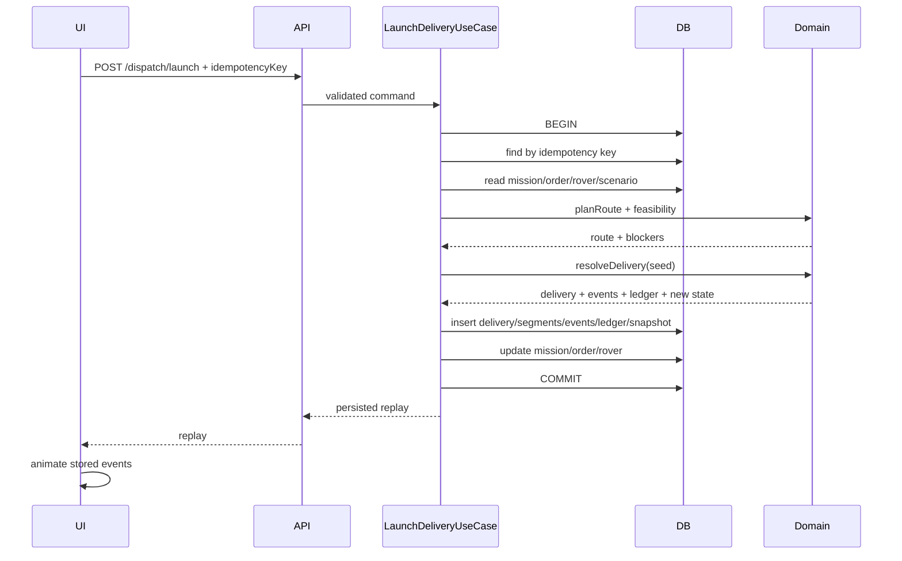
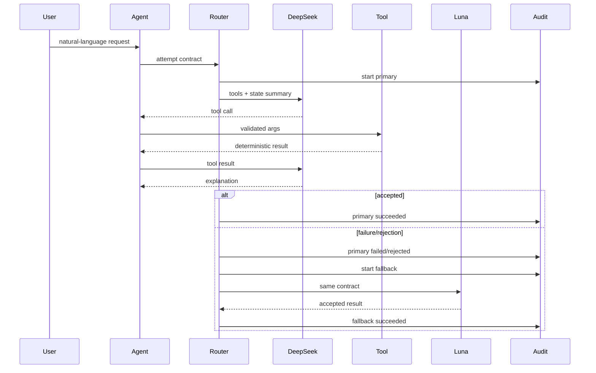

# Архитектура

## 1. Формат решения

Проект — modular monolith: один Next.js deployment unit, внутри которого слои изолированы контрактами. Это компромисс между скоростью тестового задания и возможностью дальнейшего роста.



## 2. Dependency rule

Разрешённое направление импорта:

```text
presentation → application → domain
infrastructure → application/domain contracts
AI adapters → application/domain contracts
```

Запрещено:

```text
domain → Next.js
 domain → SQLite
 domain → OpenRouter
 domain → process.env
```

## 3. Command/query split

### Commands

- launch delivery;
- charge rover;
- repair rover;
- activate scenario;
- reset mission;
- generate scenario;
- run persisted simulation.

Commands выполняются use case и при изменении данных используют транзакцию.

### Queries

- mission dashboard;
- dispatch preview;
- analytics;
- ops summary;
- scenario list.

Queries не меняют состояние.

## 4. Главный transactional flow



## 5. AI flow



## 6. Composition root

`src/infrastructure/composition/app-container.ts` — единственное место, где собираются concrete adapters:

- database;
- repositories;
- transaction runner;
- clock;
- id generator;
- AI service;
- use cases.

Это облегчает тестирование: integration tests создают in-memory SQLite и подменяют clock/id generator.

## 7. Runtime boundaries

- все DB и AI routes используют Node runtime;
- AI key доступен только серверу;
- browser получает DTO, а не database rows;
- static HTML mockups лежат отдельно в `public/mockups`;
- Next UI не зависит от mockup JavaScript.

## 8. Scale-out path

### Stage 1

```text
Next.js + SQLite
```

### Stage 2

```text
Next.js + PostgreSQL
background worker for simulations
```

### Stage 3

```text
web replicas
PostgreSQL
Redis queue
simulation workers
observability stack
```

Доменный слой и AI tool contracts при этом не меняются.
