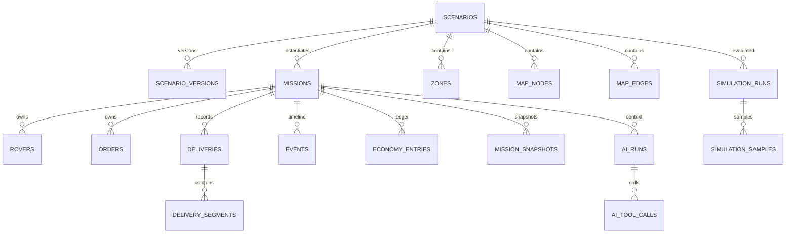

# Модель данных

## 1. Принципы

- domain entities не являются DB rows;
- JSON используется только для вложенных immutable структур и audit payload;
- основные queryable поля вынесены в колонки;
- времена — ISO 8601 UTC;
- идентификаторы создаёт приложение;
- foreign keys включены;
- все migrations ordered и idempotent.

## 2. Таблицы

### `scenarios`

Текущая проекция сценария: имя, seed, difficulty, source, rules.

### `scenario_versions`

Immutable полная версия definition + validation + prompt + model.

### `missions`

Runtime projection: время, деньги, статус, рейтинг, цель.

### `zones`, `map_nodes`, `map_edges`

Нормализованный world graph.

### `rovers`

Текущее состояние флота.

### `orders`

Текущее состояние заказов.

### `deliveries`

Одна попытка доставки и её planned/actual данные.

### `delivery_segments`

Фактически пройденные сегменты и incident outcome.

### `events`

Append-only timeline.

### `economy_entries`

Append-only financial ledger с `balance_after`.

### `mission_snapshots`

Полный JSON state после значимых операций.

### `simulation_runs`, `simulation_samples`

Input, policy, seed, summary и sample-level evidence.

### `ai_runs`, `ai_tool_calls`

Провайдер, model role, prompt version, tokens, cost, latency, response, errors и tools.

## 3. Ключевые связи



## 4. Invariants

- `deliveries.idempotency_key` unique;
- `(mission_id, sequence)` unique for events;
- `(mission_id, sequence)` unique for snapshots;
- `(delivery_id, sequence)` unique for segments;
- `(scenario_id, version)` unique;
- one order code per mission;
- one rover code per mission;
- battery 0..100;
- risk 0..<1;
- node endpoints differ;
- enum values constrained by CHECK.

## 5. Atomic delivery write set

В одной transaction:

```text
INSERT delivery
INSERT N delivery_segments
UPDATE rover
UPDATE order
UPDATE mission
INSERT N events
INSERT N economy_entries
INSERT snapshot
```

## 6. Reset semantics

Удаление миссии cascade-удаляет runtime data. Scenario/version может сохраняться как reusable template.

## 7. Backup

Для SQLite:

- остановить write traffic или использовать SQLite backup API;
- копировать `.db`, `-wal`, `-shm` согласованно;
- предпочтительно `VACUUM INTO`/backup script;
- регулярно проверять `PRAGMA integrity_check`.

## 8. PostgreSQL path

Описан в [`POSTGRES_MIGRATION.md`](POSTGRES_MIGRATION.md).
