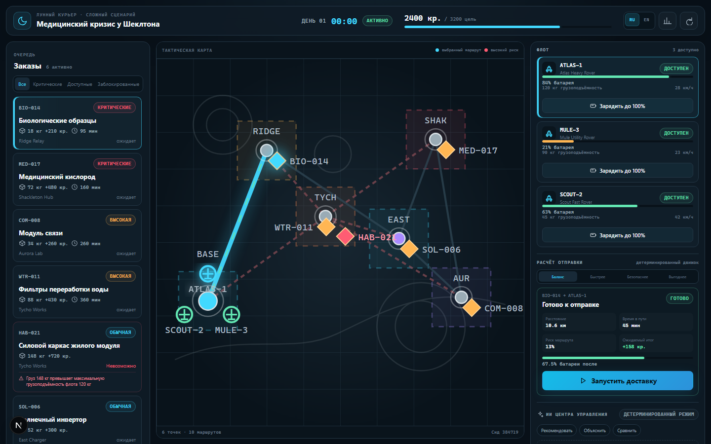
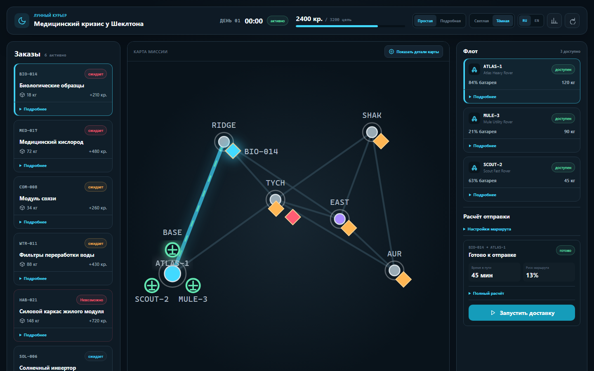
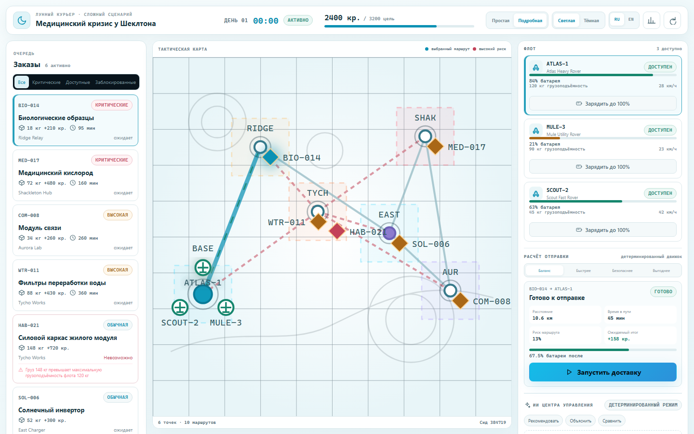
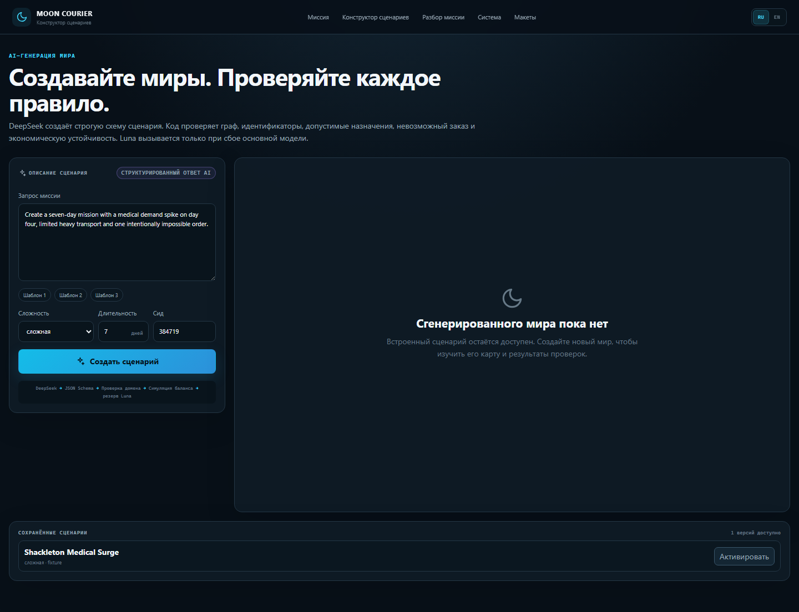
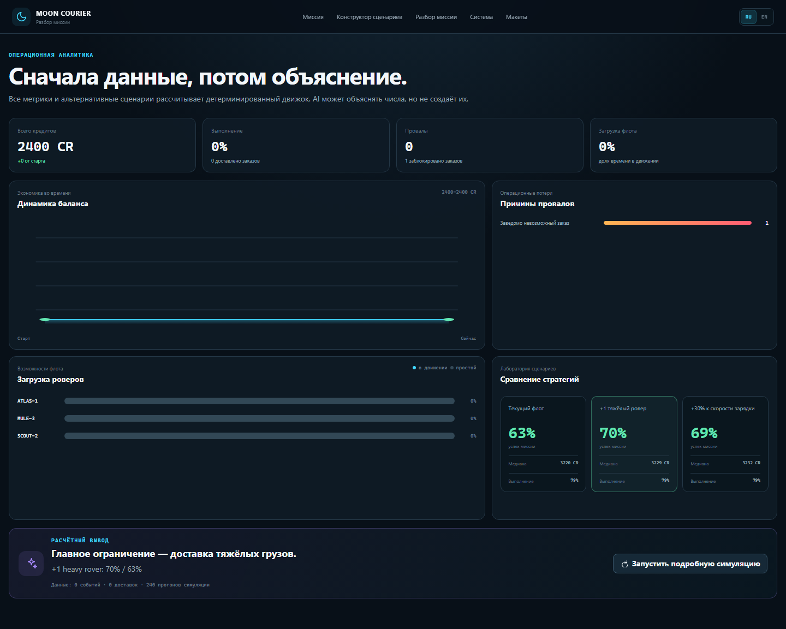
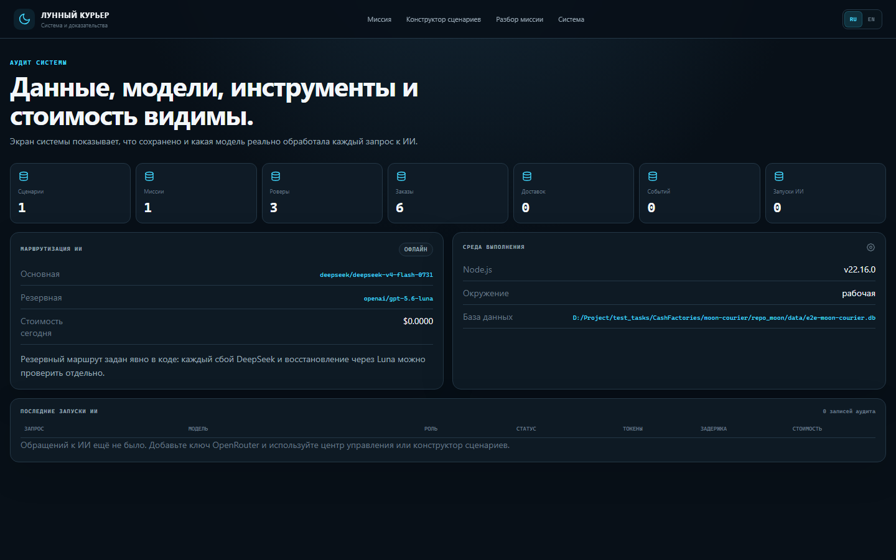

# Скриншоты интерфейса

Актуальный набор экранов, созданный командой `npm run screenshots`.

## Mission Control — простая светлая версия

## Mission Control — простая тёмная версия

## Mission Control — подробная тёмная версия

## Mission Control — подробная светлая версия

## Конструктор сценариев

## Разбор миссии

## Эксплуатационная панель

